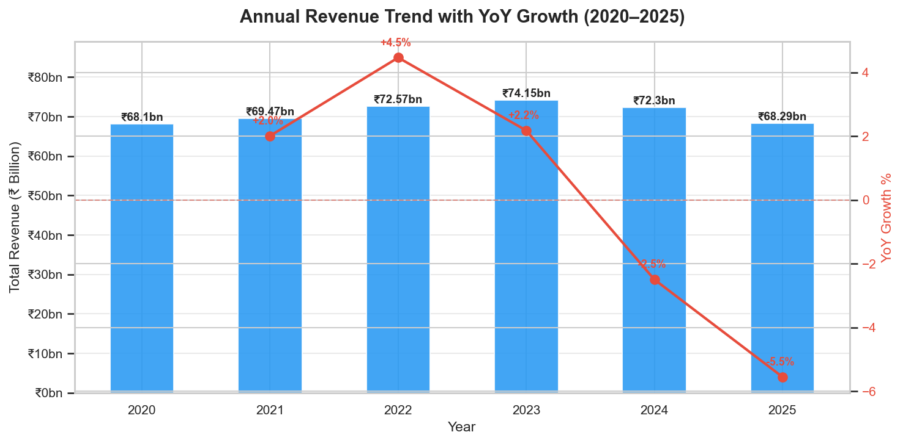
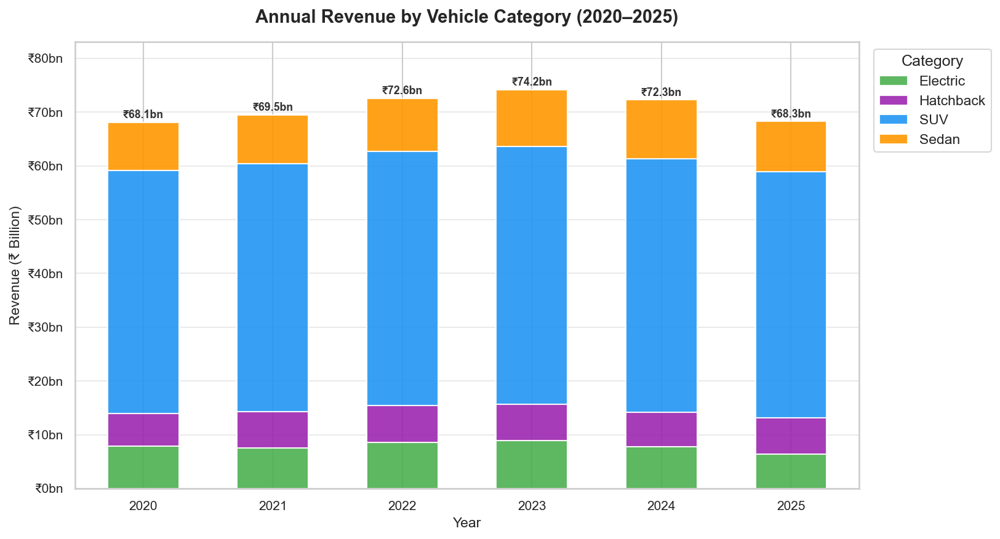
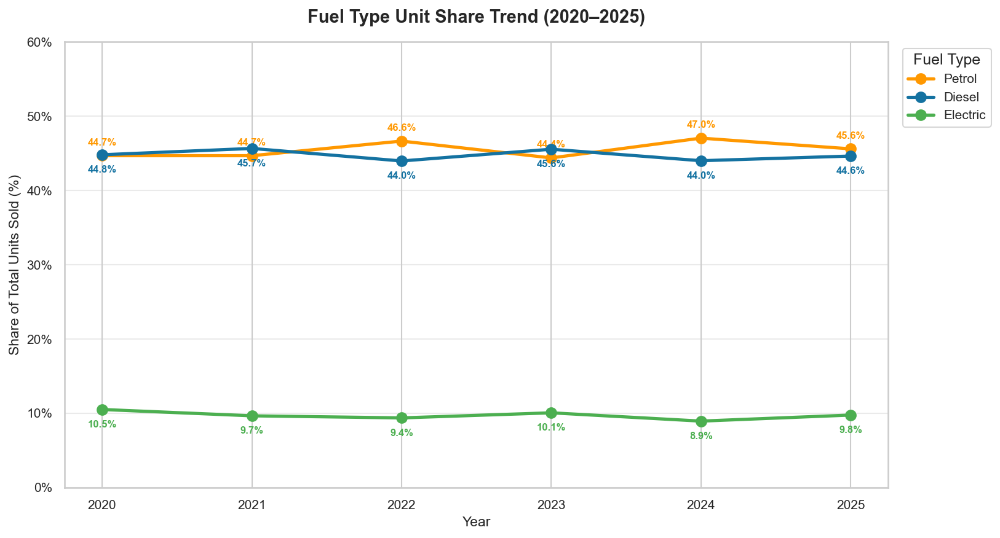
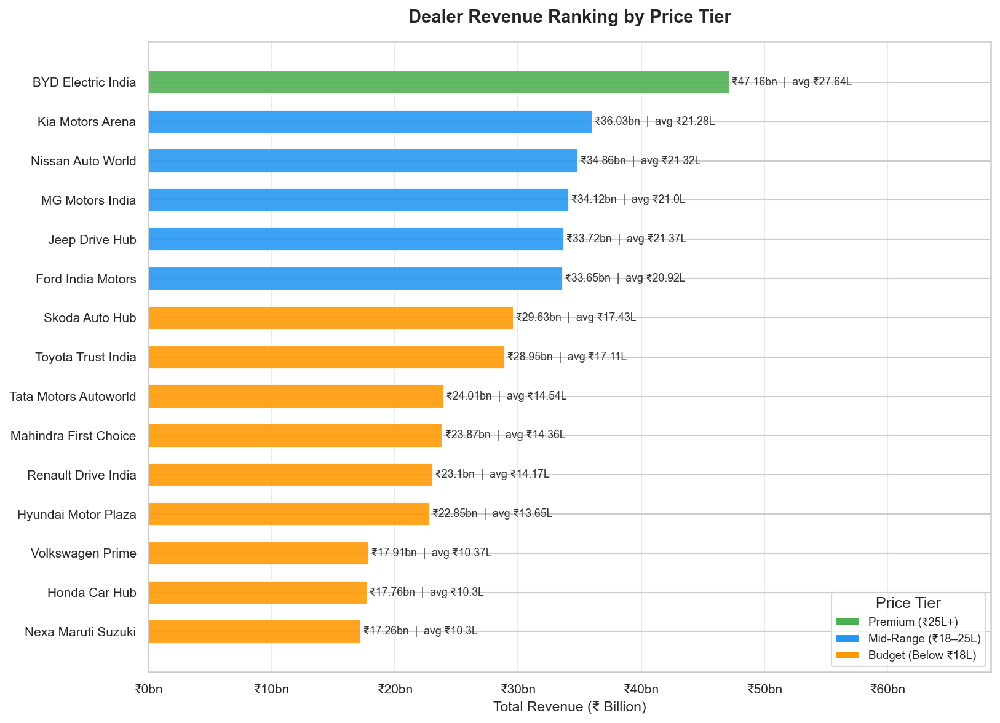
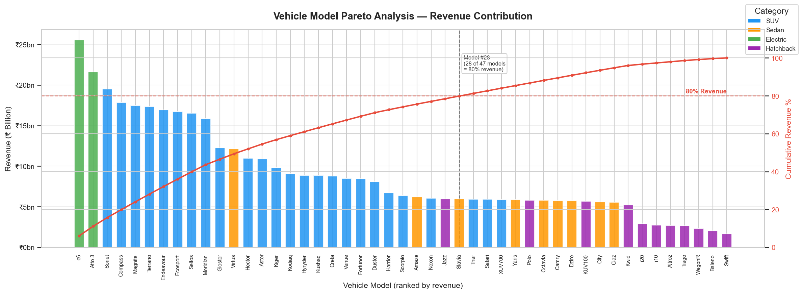
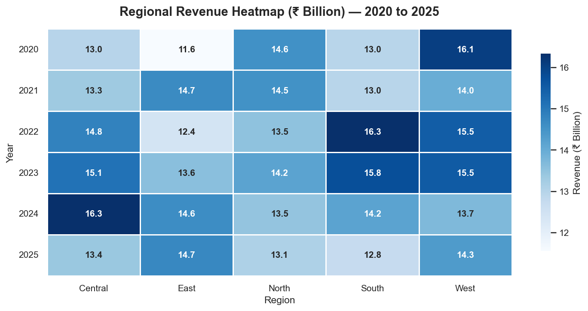
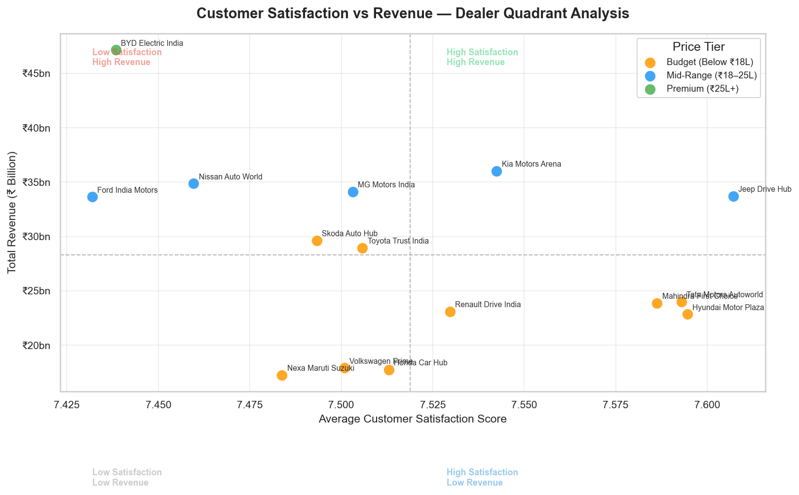
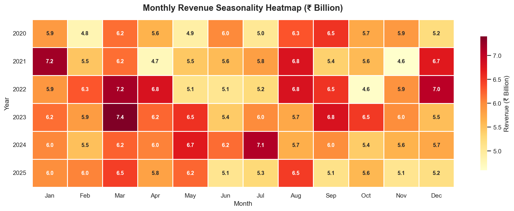

# Automobile Sales Market Analysis — India 2020–2025

> A full-stack data analytics portfolio project analysing 10,000 automobile sales transactions across 15 dealers, 5 regions, and 47 vehicle models in the Indian market from 2020 to 2025.

---

## Project Overview

The Indian automobile market underwent a significant structural shift between 2020 and 2025, driven by rising SUV demand, post-pandemic recovery, and accelerating EV adoption. Despite industry-wide growth, performance across dealers, regions, and vehicle segments remains highly uneven.

This project answers four business questions:

| # | Question |
|---|----------|
| 1 | Where is revenue being created and where is it declining across 2020–2025? |
| 2 | Which dealers lead revenue performance — and what drives the gap? |
| 3 | Is EV adoption genuinely accelerating in this dealer network? |
| 4 | What do seasonal patterns and product mix suggest for business strategy? |

---

## Key Findings

**1. Revenue declined in 2024–2025 despite stable unit volumes**
Revenue peaked at ₹74bn (2023) and fell to ₹68bn (2025) — back to 2020 levels. Unit volumes held steady at 39K–43K per year. The decline is driven by falling average selling prices, not reduced demand.

**2. BYD Electric India dominates through pricing power, not volume**
BYD generates ₹47.2bn at an average unit price of ₹27.64L — nearly 3× the budget tier. One premium EV sale generates ~4× the revenue of a hatchback sale.

**3. EV share is flat — the real shift was Diesel-to-Petrol**
Contrary to popular narrative, EV unit share remained between 8.95% and 10.51% for all 6 years — zero net acceleration. The actual fuel transition in this network was Diesel declining from 44.8% (2020) to 44.6% (2025) while Petrol rose from 44.7% to 45.6%.

**4. Satisfaction has zero correlation with revenue**
Only 14.7% of dealer-region combinations achieved both high satisfaction and high revenue. Pricing power — not customer experience — is the sole predictor of revenue performance.

**5. March and Q1 are the strongest period — not Diwali**
Q1 (Jan–Mar) accounts for 26.06% of annual revenue, driven by India's fiscal year-end effect. October — Diwali month — is the most consistent trough, appearing as the weakest month in 4 of 6 years.

## Project Structure

```
automobile-sales-analysis/
│
├── data/
│   ├── raw/
│   │   └── automobile_sales_dataset.csv        ← original dataset (never modified)
│   └── processed/
│       └── automobile_sales_cleaned.csv         ← cleaned output from Phase 1
│
├── notebooks/
│   ├── 01_data_cleaning.ipynb                   ← Phase 1: cleaning & preparation
│   └── 02_eda_charts.ipynb                      ← Phase 3: EDA & visualisations
│
├── sql/
│   └── 02_sql_analysis.sql                      ← Phase 2: 8 business queries
│
├── visuals/
│   ├── 01_annual_revenue_trend.png
│   ├── 02_revenue_by_category.png
│   ├── 03_fuel_type_trend.png
│   ├── 04_dealer_ranking.png
│   ├── 05_pareto_models.png
│   ├── 06_regional_heatmap.png
│   ├── 07_satisfaction_vs_revenue.png
│   └── 08_monthly_seasonality.png
│
├── dashboard/
│   └── Automobile_Sales_Dashboard.pbix          ← Phase 4: Power BI dashboard
│
├── report/
│   ├── Automobile_Sales_Report.docx             ← Phase 5: written case study
│   └── Automobile_Sales_Analysis.pptx           ← Phase 5: presentation deck
│
└── README.md
```

---

## Tools & Technologies

| Tool | Purpose |
|------|---------|
| **Python** (Pandas, NumPy) | Data cleaning, feature extraction, outlier detection |
| **PostgreSQL** | 8 SQL business queries — trends, rankings, correlations |
| **Matplotlib + Seaborn** | 8 analytical charts — Pareto, heatmaps, scatter, trend lines |
| **Power BI** | 3-page interactive dashboard with DAX measures |

---

## Dashboard Preview

The Power BI dashboard has 3 pages:

| Page | Focus | Key Visuals |
|------|-------|-------------|
| **Sales Overview** | Business performance 2020–2025 | Revenue trend, regional bar chart, category donut, monthly area chart |
| **Dealer Analysis** | Dealer performance benchmarking | Revenue ranking, avg unit price, satisfaction scatter, trend lines |
| **Market Trends** | EV & category strategy | 100% stacked fuel type chart, top 10 models, category trend |

All visuals cross-filter dynamically — clicking any dealer in the ranking chart filters all other visuals on the page.

---

## SQL Analysis (Phase 2)

8 business queries written in PostgreSQL:

| Query | Business Question |
|-------|------------------|
| Q1 — Business Overview | What is the overall scale of the business? |
| Q2 — Yearly Trend | How has revenue trended year-on-year? |
| Q3 — Regional Performance | Which regions drive the most revenue? |
| Q4 — Dealer Ranking | How do all 15 dealers rank across key metrics? |
| Q4B — Dealer Tiers | Which dealers are Premium, Mid-Range, or Budget? |
| Q5 — Category & Fuel Type | Which segments dominate and how is EV growing? |
| Q6 — Pareto Analysis | Which models drive 80% of revenue? |
| Q7 — Satisfaction vs Revenue | Does higher satisfaction translate to higher revenue? |
| Q8 — Seasonal Trends | When does the business consistently peak and trough? |

---

## Charts (Phase 3)

| Chart | Finding |
|-------|---------|
| Annual Revenue Trend | Revenue peaked in 2023, declining 2024–2025 with stable volume |
| Revenue by Category | SUV = 65.79% of all revenue |
| Fuel Type Trend | EV share flat at 9–10% — no acceleration across 6 years |
| Dealer Ranking | BYD dominates — ₹47.2bn vs next dealer at ₹36bn |
| Pareto Analysis | 28 of 47 models (59.6%) needed to reach 80% revenue |
| Regional Heatmap | Even ~20% distribution across all 5 regions |
| Satisfaction Scatter | No correlation between satisfaction and revenue |
| Seasonality Heatmap | March strongest in aggregate, October most consistent trough |

---

## 📸 Sample Visuals










---

## Dataset

| Attribute | Detail |
|-----------|--------|
| Source | Indian Automobile Sales Dataset |
| Records | 10,000 transactions |
| Time period | January 2020 – December 2025 |
| Dealers | 15 (Hyundai, Tata, BYD, Ford, Kia, MG, Toyota, and more) |
| Regions | North, South, East, West, Central |
| Vehicle models | 47 across SUV, Sedan, Hatchback, Electric categories |
| Null values | None |
| Duplicates | None |

---

## Limitations

- Customer satisfaction scores show near-zero variance (7.17–7.83 range) across all dealers — limiting its use as an analytical differentiator
- Revenue data reflects gross sales only — no cost, margin, or profitability data available
- Dataset covers a specific dealer network and may not generalise to the broader Indian automobile market
- No customer demographic data (age, income, location within region) available for segmentation

---

## Deliverables

| Phase | Deliverable | Description |
|-------|-------------|-------------|
| Phase 1 | `01_data_cleaning.ipynb` | Data loading, QA checks, cleaning, feature extraction |
| Phase 2 | `02_sql_analysis.sql` | 8 business queries with comments |
| Phase 3 | `02_eda_charts.ipynb` + `/visuals` | EDA notebook + 8 PNG charts |
| Phase 4 | `Automobile_Sales_Dashboard.pbix` | 3-page interactive Power BI dashboard |
| Phase 5 | `Automobile_Sales_Report.docx` | 8-page written case study report |
| Phase 6 | `Automobile_Sales_Analysis.pptx` | 8-slide presentation deck |


